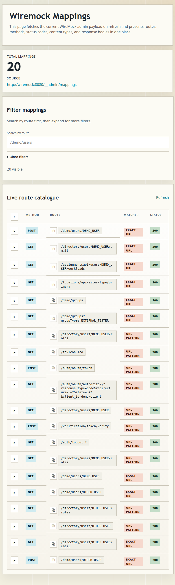

# WireMock Frontend

An easier way to browse WireMock mappings than digging through raw admin JSON.



The app fetches the current admin payload from `WIREMOCK_BASE_URL/__admin/mappings` on each page refresh and renders:

- route and matcher type
- HTTP method
- response status
- content type
- response payload preview
- client-side search and method filtering

## Use The Published Image

The container listens on port `8782` and reads the WireMock admin endpoint from `WIREMOCK_BASE_URL`.

Defaults:

- app port: `8782`
- WireMock admin base URL: `http://wiremock:8080`

Published images:

```bash
docker pull ghcr.io/a6software/wiremock-ui:latest
docker pull ghcr.io/a6software/wiremock-ui:main
```

Tagged releases also publish semantic version tags such as:

```bash
docker pull ghcr.io/a6software/wiremock-ui:1.2.3
docker pull ghcr.io/a6software/wiremock-ui:1.2
docker pull ghcr.io/a6software/wiremock-ui:1
```

Package page:

https://github.com/orgs/a6software/packages/container/package/wiremock-ui

## Quick Start

If WireMock and the UI are both running as containers, put them on the same Docker network and point the UI at the WireMock service name.

Create or reuse a shared Docker network:

```bash
docker network create your-existing-network
```

Run WireMock:

```bash
docker run --rm \
  --name wiremock \
  --network your-existing-network \
  -p 9091:8080 \
  rodolpheche/wiremock
```

Run the UI:

```bash
docker run --rm \
  --name wiremock-frontend \
  --network your-existing-network \
  -p 8782:8782 \
  -e WIREMOCK_BASE_URL=http://wiremock:8080 \
  ghcr.io/a6software/wiremock-ui:latest
```

Then open:

- WireMock UI: `http://localhost:8782`
- WireMock admin from your host: `http://localhost:9091/__admin/mappings`

## Docker Compose Example

```yaml
services:
  wiremock:
    image: rodolpheche/wiremock
    container_name: wiremock
    restart: unless-stopped
    networks:
      - your-existing-network
    ports:
      - "9091:8080"

  wiremock-frontend:
    image: ghcr.io/a6software/wiremock-ui:latest
    container_name: wiremock-frontend
    restart: unless-stopped
    networks:
      - your-existing-network
    ports:
      - "8782:8782"
    environment:
      - WIREMOCK_BASE_URL=http://wiremock:8080

networks:
  your-existing-network:
    driver: bridge
```

## Choosing `WIREMOCK_BASE_URL`

- Use `http://wiremock:8080` when the UI and WireMock run as containers on the same Docker network.
- Use `http://localhost:9091` only when the UI runs directly on your host.
- From inside a container, `localhost` refers to that container itself.
- If the UI container needs to reach a WireMock instance running on your host machine, use `http://host.docker.internal:9091` on Docker Desktop.

## Troubleshooting

- If the page shows `Unable to reach WireMock`, first check that `WIREMOCK_BASE_URL` matches where WireMock is actually reachable from the UI process.
- If you can reach WireMock at `localhost:9091` from your browser, that does not mean a container can use `localhost:9091`.
- Verify the admin endpoint directly at `http://localhost:9091/__admin/mappings`.

## Developer Setup

Run locally:

```bash
./gradlew bootRun
```

Override for a host-run WireMock on port `9091`:

```bash
WIREMOCK_BASE_URL=http://localhost:9091 ./gradlew bootRun
```

Build the image locally:

```bash
docker build -t wiremock-frontend .
```

## Developer Tasks

Test:

```bash
./gradlew test
```

## Release

Use the `Create Release` GitHub Action and choose `patch`, `minor`, or `major`.

That workflow:

- runs the Kotlin and Playwright test suites
- pauses at the `release` environment for approval if you configure required reviewers
- creates the next `vX.Y.Z` git tag
- publishes the matching Docker tags
- creates a GitHub release

To get the approve or reject step in Actions, create a `release` environment in GitHub and add
required reviewers to it.

- `1.2.3`
- `1.2`
- `1`
- `latest`
